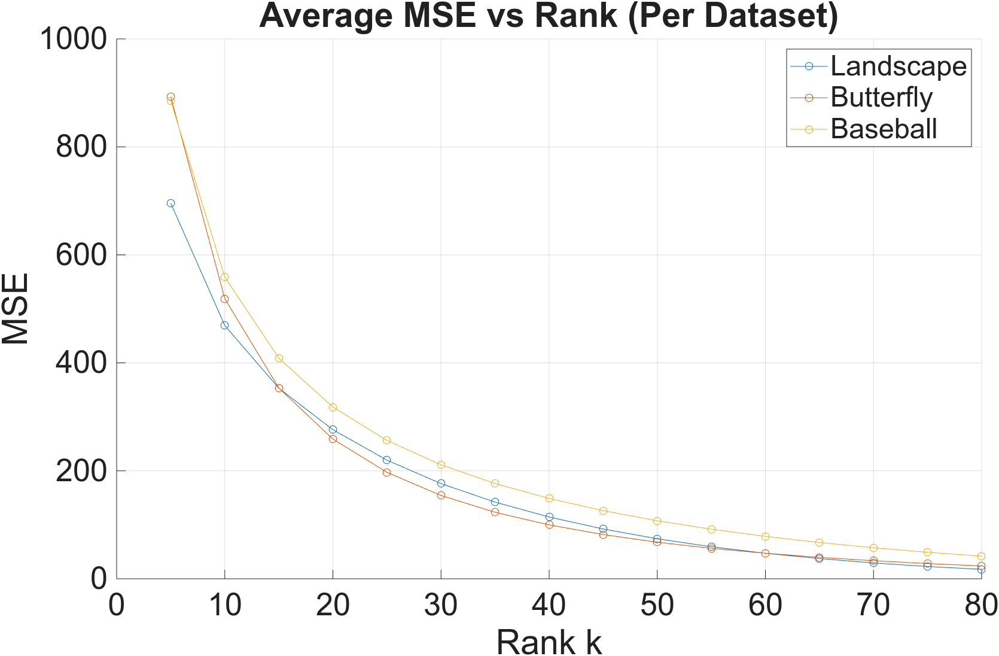
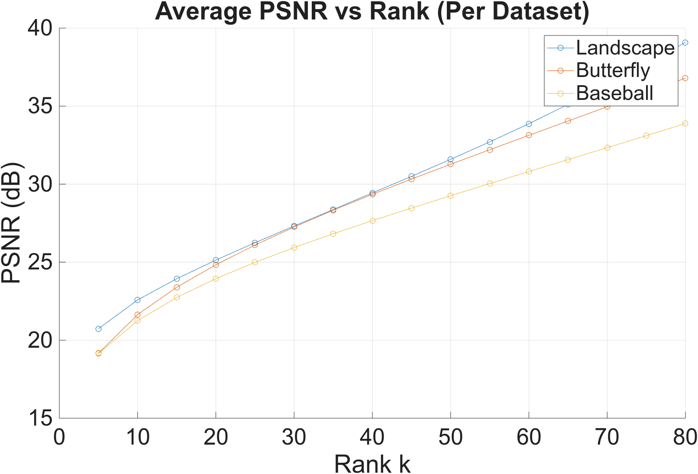
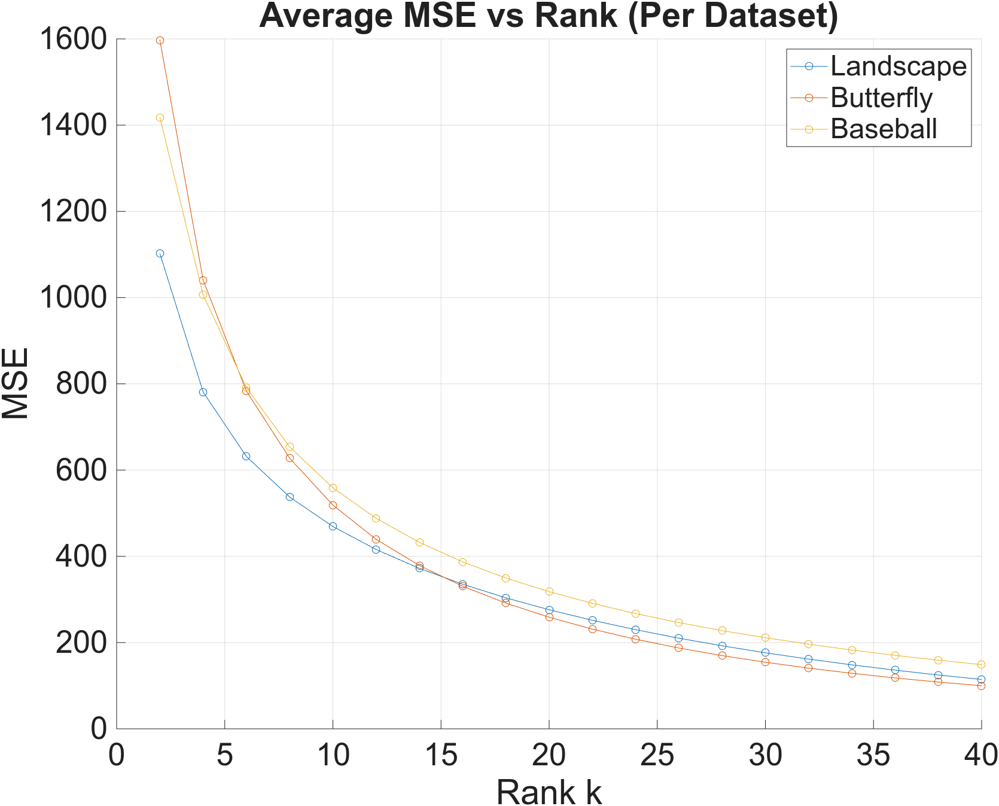
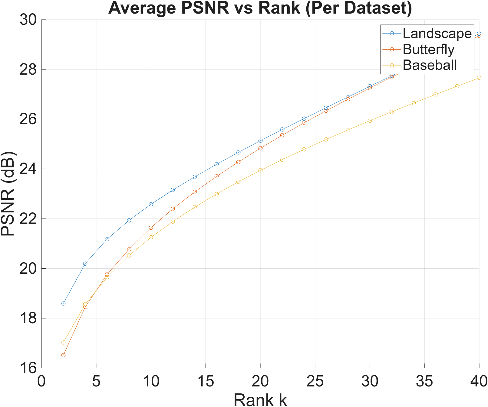
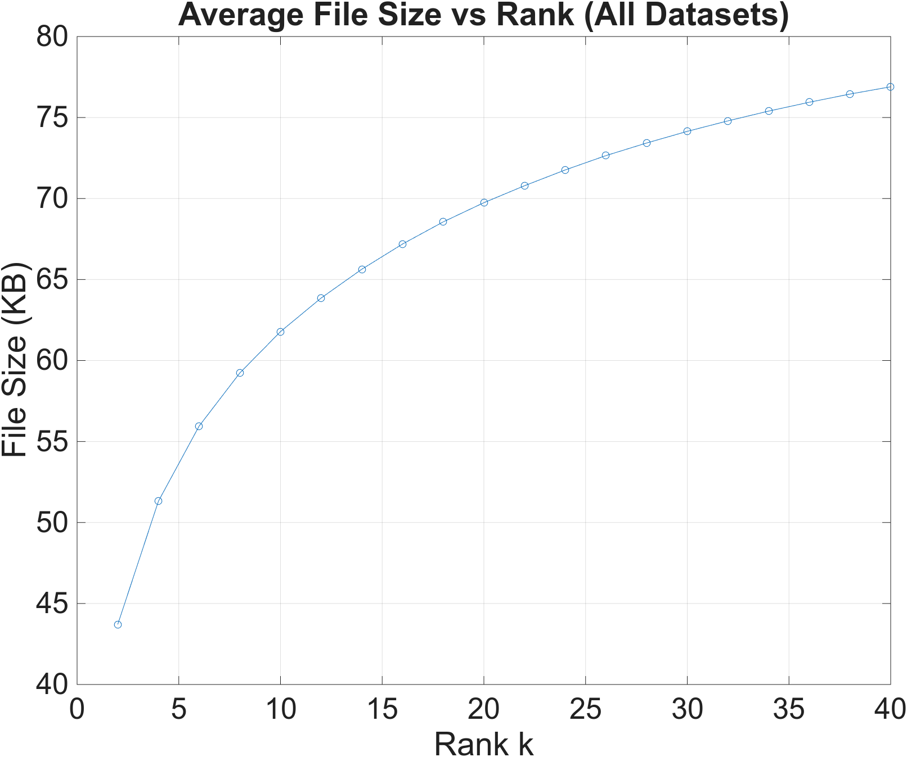
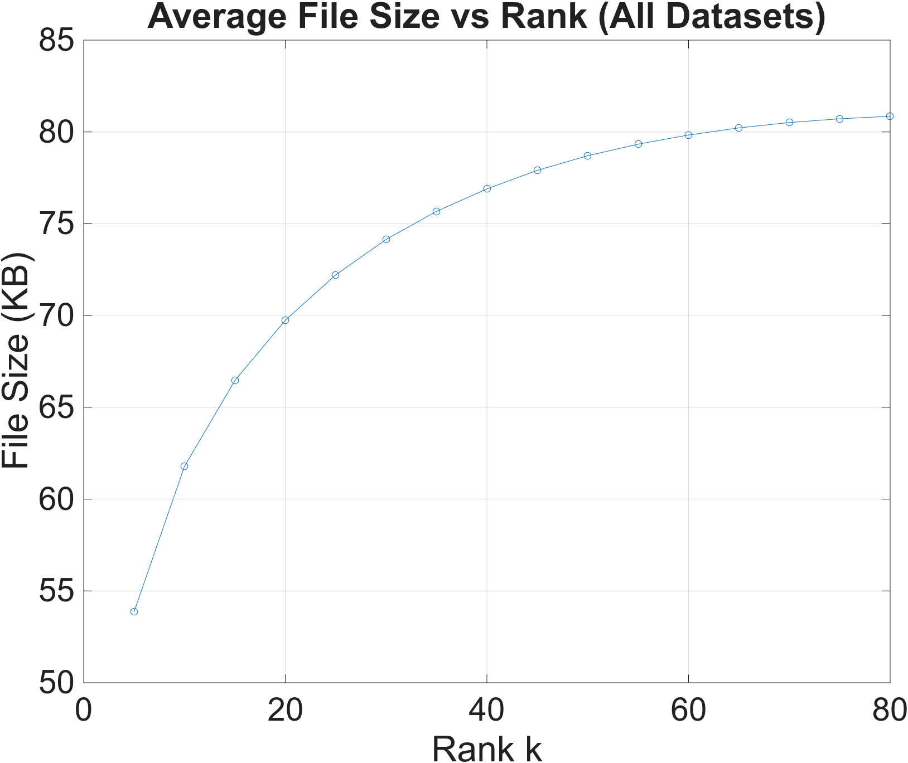

### Author: Pierre Visconti  
#### M441 — Numerical Linear Algebra & Optimization — Montana State University  

**Disclaimer:** This repository is provided as an academic reference and personal research record.  
Do not copy or submit this work as your own.

---

# Quality Versus Storage in SVD‑Based Image Compression  
[Link to full research paper](M441_svd.pdf)

## Overview
Low-rank matrix approximations using Singular Value Decomposition (SVD) are an effective approach to image compression. This project examines how varying the number of top k singular values impacts image quality and file size across three diverse datasets of colored JPEG images. Each image, randomly sampled from their respective dataset, was reconstructed at multiple ranks and saved as a PNG file to avoid additional lossy compression. Quality was assessed using Mean Squared Error (MSE) and Peak Signal-to-Noise Ratio (PSNR), while file size was directly recorded from the output PNG file. Results show that MSE decreases exponentially with increasing k, PSNR grows logarithmically, and file size also follows a logarithmic trend due to PNG’s compression algorithm. Based on our combined generated curves from all three datasets and individual analysis of each dataset, we determined the optimal k to be 25-30, which best balances image quality and file size.

---

## Datasets
To ensure generalizable results, three diverse image datasets were selected:

- **Landscape Images** — 7,129 images  
- **Butterfly Close‑Ups** — 9,285 images  
- **Baseball Sports Images** — 179 images  

All images were originally JPEGs.  
To avoid additional lossy compression, reconstructed images were saved as **PNG**.

Each dataset provides different textures, colors, and structures, enabling a robust multi‑dataset evaluation.

---

## Methods
### Singular Value Decomposition (SVD)

Given an image matrix A, SVD decomposes it as:

A = U * Σ * V^T

A rank‑k approximation is constructed by keeping only the top k singular values:

A_k = U_k * Σ_k * V_k^T

This reduces storage while introducing controlled loss of detail.

### Experimental Procedure
For each dataset:

1. Randomly sample **50 images**.  
2. Compress each image using SVD for \(k = 5, 10, ..., 80\).  
3. Save each reconstruction as PNG.  
4. Compute:  
   - **MSE** (lower = better quality)  
   - **PSNR** (higher = better quality)  
   - **File size** of the PNG output  
5. Average results across images and datasets.  

A finer analysis was performed for \(k = 2, 4, ..., 40\) to identify the optimal quality–storage trade‑off.

---

## Key Results

### Image Quality Trends
- **MSE decreases exponentially** as \(k\) increases.  
- **PSNR increases logarithmically** with \(k\).  
- All datasets show consistent behavior.  
- Quality gains diminish significantly beyond moderate \(k\) values.

### File Size Trends
- File size grows **logarithmically**, not linearly.  
- Lower‑rank reconstructions add highly compressible structure.  
- Higher‑rank reconstructions add less compressible detail.

---

## Figures

## 1–2. MSE and PSNR vs. Rank (k in [5,80])

  
  

## 3–4. MSE and PSNR vs. Rank (k in [2,40])

  
  

## 5–6. File Size vs. Rank

  
  

---

## Optimal Rank Selection
Across all datasets:

- **k ≈ 25–30** provides the best balance between quality and file size.  
- Lower \(k\) is suitable for ML tasks where pattern recognition matters more than fidelity.  
- Higher \(k\) may be preferred for visually sensitive applications.
